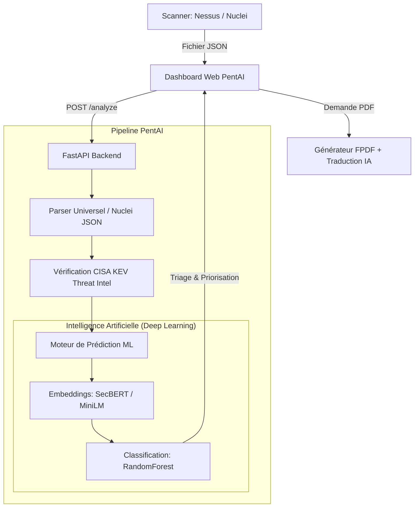

# PentAI - DevSecOps & Triage Intelligent des Vulnérabilités 🛡️🧠

PentAI est un outil DevSecOps moderne développé pour analyser, trier et prioriser automatiquement les vulnérabilités de sécurité remontées par les scanners de marché. Il s'appuie sur le Deep Learning (SecBERT) et la Threat Intelligence en temps réel.

## 🎯 Valeur Métier (Business Value)

J'ai remarqué que lors de l'utilisation d'outils tels que Nessus ou bien Nuclei, les équipes de cybersécurité (SOC / CERT) souffrent aujourd'hui d'une **fatigue des alertes**. Les scanners traditionnels génèrent énormément de bruit et remontent des centaines, voire des milliers de vulnérabilités brutes, sans véritable contexte lié au monde réel. Se baser uniquement sur le score mathématique (CVSS) fourni par le scanner ne suffit plus : une faille complexe peut avoir un score élevé mais n'être que très rarement exploitée, tandis qu'une petite erreur de configuration ignorée par le scanner peut être une porte d'entrée fatale.

**PentAI résout ce problème majeur et apporte une valeur métier immédiate par :**

1. **L'Intelligence Sémantique (Deep Learning / SecBERT)** : Au lieu de faire aveuglément confiance aux chiffres d'un scanner, l'Intelligence Artificielle "lit" et "comprend" la description technique de la faille. Elle repère les patterns d'attaques et réévalue elle-même la véritable dangerosité de la vulnérabilité, grâce à un apprentissage sur plus de 11 000 cas réels.
2. **Le Renseignement sur les Menaces (CTI - CISA KEV)** : PentAI est directement connecté au catalogue officiel du gouvernement américain (CISA KEV). Si une faille est détectée comme étant *activement exploitée par des groupes de hackers dans le monde*, le système court-circuite l'IA, classe la faille en **Urgence Absolue** et affiche une alerte rouge 🚨.
3. **Le Gain de Temps et la Réduction du Bruit** : Automatisation intégrale du triage. L'analyste n'a plus qu'à faire glisser son fichier d'export brut (ex: Nuclei JSON) dans l'interface, et l'équipe sait instantanément quels correctifs doivent être appliqués aujourd'hui.
4. **La Démocratisation (Rapports Automatisés)** : Génération à la volée de rapports d'audit PDF professionnels. L'outil intègre une traduction automatique des jargons complexes (Anglais -> Français) pour faciliter la communication avec les décideurs métiers.

---

## 🏗️ Architecture du Projet

Le projet suit une architecture modulaire et scalable basée sur **FastAPI**, **SentenceTransformers** et un Frontend "Glassmorphism" moderne.



### 📁 Arborescence des fichiers
```text
PentAI/
├── app/
│   ├── main.py                # Point d'entrée FastAPI
│   ├── routes/analyze.py      # Route API (Analyse JSON & Génération PDF)
│   ├── services/              # Logique (CTI CISA KEV, Parser Nuclei, Générateur PDF)
│   ├── static/                # Frontend Web (HTML, JS, CSS UI Moderne)
│   ├── model/                 # Algorithmes d'IA (SecBERT + Classifier)
│   └── utils/nvd_fetcher.py   # Script de Scraping NVD (11 000+ failles)
├── data/
│   ├── model/                 # Modèles IA entraînés (.pkl)
│   └── raw/                   # Données d'entraînement et scans d'exemples
├── tests/                     # Tests unitaires Pytest
├── requirements.txt           # Dépendances Python
└── README.md
```

---

## 🚀 Installation & Utilisation

### 1. Prérequis
Assurez-vous d'avoir Python 3.10+ installé.
```bash
python -m venv venv
# Sur Windows :
.\venv\Scripts\activate
# Sur Linux/Mac :
source venv/bin/activate

pip install -r requirements.txt
```

### 2. Entraîner l'Intelligence Artificielle (Optionnel)
Le projet est livré pré-entraîné, mais vous pouvez lancer vous-même la récupération des 11 000+ failles réelles et le ré-entraînement du cerveau :
```bash
# Télécharger les données réelles (Gère les coupures API NIST)
python -m app.utils.nvd_fetcher

# Lancer la vectorisation SecBERT et l'entraînement RandomForest
python -m app.model.train
```

### 3. Lancer l'Outil Web
```bash
uvicorn app.main:app --reload
```

### 4. Utilisation
1. Ouvrez votre navigateur sur **[http://127.0.0.1:8000](http://127.0.0.1:8000)**.
2. Cliquez sur **"Load Sample Scan"** pour tester le pipeline complet avec une faille KEV factice.
3. Ou, effectuez un scan avec **Nuclei** (`nuclei -u cible.com -json-export scan.json`) et déposez directement le fichier JSON dans la zone prévue à cet effet.
4. Cliquez sur **"📄 PDF (FR)"** pour télécharger le rapport d'audit final.
