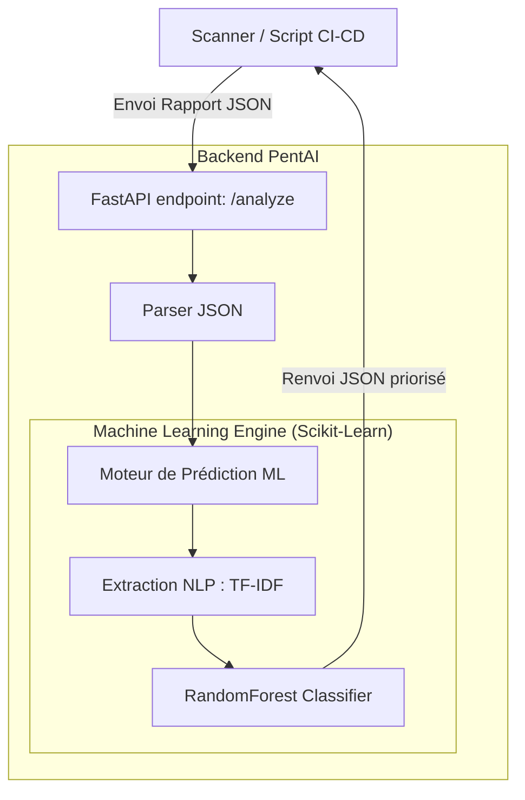
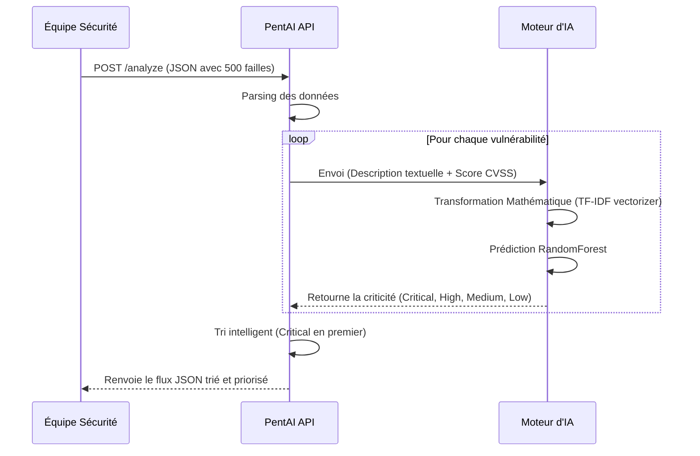

# PentAI - Priorisation Intelligente des Vulnérabilités 🛡️🧠

PentAI est un système intelligent développé pour analyser et prioriser automatiquement les vulnérabilités de sécurité remontées par les scanners, en s'appuyant sur l'intelligence artificielle (Machine Learning) et le traitement du langage naturel (NLP).

## 🎯 Valeur Métier (Business Value)

Les équipes de cybersécurité (SOC / CERT) souffrent aujourd'hui d'une **fatigue des alertes** : les scanners traditionnels génèrent trop de bruit et remontent des centaines de vulnérabilités sans contexte. Se baser uniquement sur le score mathématique CVSS ne suffit plus, car une faille complexe à exploiter peut avoir un score élevé.

**PentAI résout ce problème et apporte de la valeur par :**
1. **La réduction du bruit** : Identification automatique des vulnérabilités mineures ou très contextuelles pour les reléguer au second plan.
2. **L'analyse Sémantique (NLP)** : L'IA "lit" la description de la faille (ex: mots-clés comme "remote code execution", "unauthenticated"). Elle comprend le vrai risque d'exploitabilité.
3. **Le gain de temps massif** : Automatisation du triage. L'équipe IT sait instantanément sur quels correctifs critiques elle doit concentrer son temps.

---

## 🏗️ Architecture du Projet

Le projet suit une architecture modulaire et scalable basée sur **FastAPI** et **Scikit-Learn**.



### 📁 Arborescence des fichiers
```text
PentAI/
├── app/
│   ├── main.py                # Point d'entrée FastAPI
│   ├── routes/analyze.py      # Route API principale (POST)
│   ├── services/              # Logique métier (parsing, orchestration)
│   ├── model/                 # Algorithmes d'IA (train, predict, features)
│   └── utils/nvd_fetcher.py   # Script de connexion à l'API NIST/NVD
├── data/
│   ├── model/                 # Modèles IA compilés (.pkl)
│   └── raw/                   # Données de test et d'entraînement
├── notebooks/                 # Notebook Jupyter d'exploration de données
├── tests/                     # Tests d'intégration Pytest
├── requirements.txt           # Dépendances Python
└── README.md
```

---

## 🔄 Diagramme de Séquence

Voici comment le système traite une requête entrante :



---

## 🚀 Installation & Utilisation

### 1. Prérequis
Assurez-vous d'avoir Python 3.10+ installé.
```bash
python -m venv venv
# Sur Windows :
.\venv\Scripts\activate
# Sur Linux/Mac :
source venv/bin/activate

pip install -r requirements.txt
```

### 2. Entraîner l'Intelligence Artificielle (Optionnel)
Le projet est livré avec un script capable de télécharger de vraies vulnérabilités depuis le gouvernement américain (NVD) pour s'entraîner.
```bash
# Télécharger les données réelles
python app/utils/nvd_fetcher.py

# Entraîner le modèle RandomForest et générer les .pkl
python -m app.model.train
```

### 3. Lancer l'API
```bash
uvicorn app.main:app --reload
```

### 4. Tester l'API (Swagger)
Rendez-vous sur [http://127.0.0.1:8000/docs](http://127.0.0.1:8000/docs).
Vous pouvez tester la route `POST /analyze` en utilisant le contenu du fichier `data/raw/sample_scan.json` fourni dans le projet. L'IA lira vos vulnérabilités et vous renverra un rapport d'urgence structuré !

---
*Projet développé pour optimiser les processus de type DevSecOps et SOC.*
